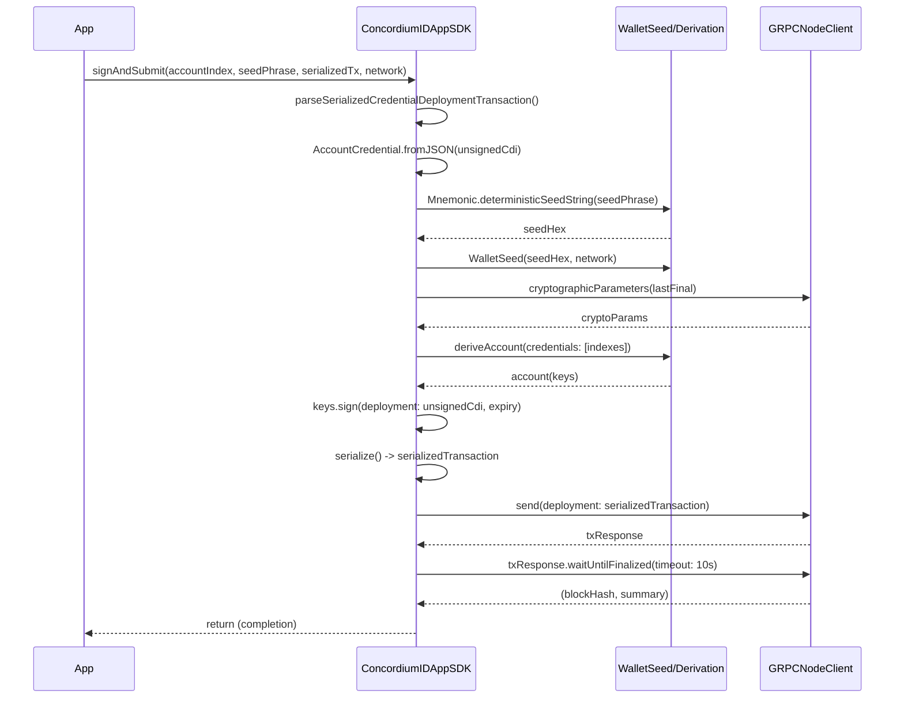
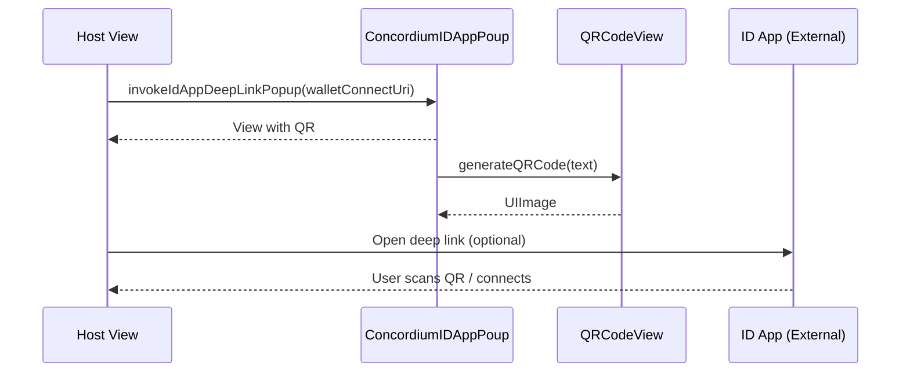

## Concordium ID Swift SDK - Low Level Design (LLD)

This document describes the SDK internals intended for maintainers and integrators. It covers module responsibilities, key types, control flow, and sequence diagrams for core operations.

### Modules

- Core
  - `ConcordiumIDAppSDK`: Public entry point. Signs and submits credential deployment transactions, builds request payloads, derives account key pairs.
  - `AccountCredential+Decoding`: Decoding glue for `AccountCredential` (from ConcordiumWalletCrypto) including helpers.
  - `Proofs+Decoding`: Decoding for `Proofs` fields from hex-encoded JSON.
  - `HexDecoding`: Utility to convert hex strings to `Bytes` with strict validation.

- UI
  - `ConcordiumIDAppPoup`: Popup surface for QR connection or provide-flow (create/recover).
  - `QRCodeView`: Renders a QR from text.
  - `ConcordiumBrandViews`: Logo and App Store button.
  - `StepsViews`: Small step indicator components.

### Key Public APIs

- `ConcordiumIDAppSDK.signAndSubmit(accountIndex:seedPhrase:serializedCredentialDeploymentTransaction:network:)`
  - Parses input JSON into `SerializedCredentialDeploymentTransaction`.
  - Decodes `unsignedCdi` string into `AccountCredential` via custom decoding extensions.
  - Derives keys from BIP39 seed and signs a credential deployment.
  - Submits over GRPC and waits for finalization.

- `ConcordiumIDAppSDK.generateAccountWithSeedPhrase(from:network:accountIndex:)`
  - Deterministically derives a Concordium account key pair as hex strings.

- UI Builders
  - `ConcordiumIDAppPoup.invokeIdAppDeepLinkPopup(walletConnectUri:)`
  - `ConcordiumIDAppPoup.invokeIdAppActionsPopup(onCreateAccount:onRecoverAccount:walletConnectSessionTopic:)`

### Data Models

- `SerializedCredentialDeploymentTransaction`
  - `expiry: UInt64`
  - `randomness: Randomness`
    - `attributesRand: AttributesRand` (various attribute seeds)
    - `credCounterRand`, `idCredSecRand`, `maxAccountsRand`, `prfRand`
  - `unsignedCdi: String` (JSON for `AccountCredential`)

- `CCDAccountKeyPair`
  - `privateKey: String` (hex)
  - `publicKey: String` (hex)

### Decoding Utilities

- `bytesFromHexString(_:)` in `HexDecoding.swift`: Validates and decodes with optional `0x` prefix.
- `AccountCredential: Decodable` and helpers: Converts string-keyed `arData` to `UInt32` keys, decodes hex `credId`, and composes nested models.
- `Proofs: Decodable` (hex to bytes for challenge, commitments, proofs, signature; map values for `proofIdCredPub`).

---

### Sequence: Credential Deployment (signAndSubmit)



Notes:
- Exceptions are surfaced as `SDKError` (e.g., `networkFailure`).
- The current API does not return the hash/summary; it can be extended in a non-breaking way by adding a return type.

### Sequence: UI Provide Flow (Create or Recover)

```mermaid
sequenceDiagram
    participant Host as Host View
    participant Popup as ConcordiumIDAppPoup
    participant Create as onCreateAccount (async)
    participant Recover as onRecoverAccount (async)

    Host->>Popup: invokeIdAppActionsPopup(onCreateAccount?, onRecoverAccount?, topic?)
    Popup-->>Host: View
    Host->>Host: Present Popup
    alt Create available
        Host->>Popup: Tap "Create New Account"
        Popup->>Create: runCreate()
        Create-->>Popup: completion
    end
    alt Recover available
        Host->>Popup: Tap "Recover Account/Recover"
        Popup->>Recover: runRecover()
        Recover-->>Popup: completion
    end
    Host->>Popup: Close (button)
    Popup->>Host: Notification (close)
```

### Sequence: QR Connection Flow



---

### Error Handling & Invariants

- `withGRPCClient`: Always closes channel and shuts down event loop group in success and error paths. Wraps errors into `SDKError.networkFailure`.
- Decoding paths throw Swift `DecodingError` with contextual messages; hex parsing throws `HexDecodingError`.
- UI builders validate input (e.g., non-empty URI, required topic for create flow) and use `fatalError` for programmer errors in SDK usage during development.

### Extensibility Notes

- Return values for `signAndSubmit` can be extended to include transaction hash and finalization summary.
- `GRPCOptions` can be exposed/configured for different networks/environments.
- UI flows are composable SwiftUI views and can be themed by the host application.


